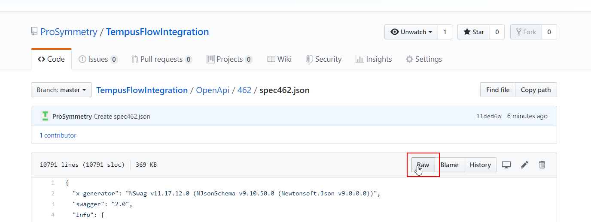
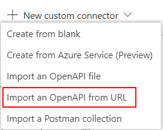
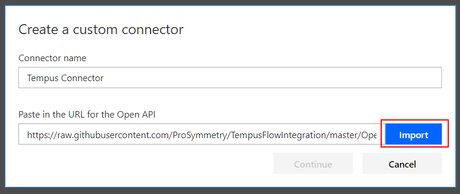
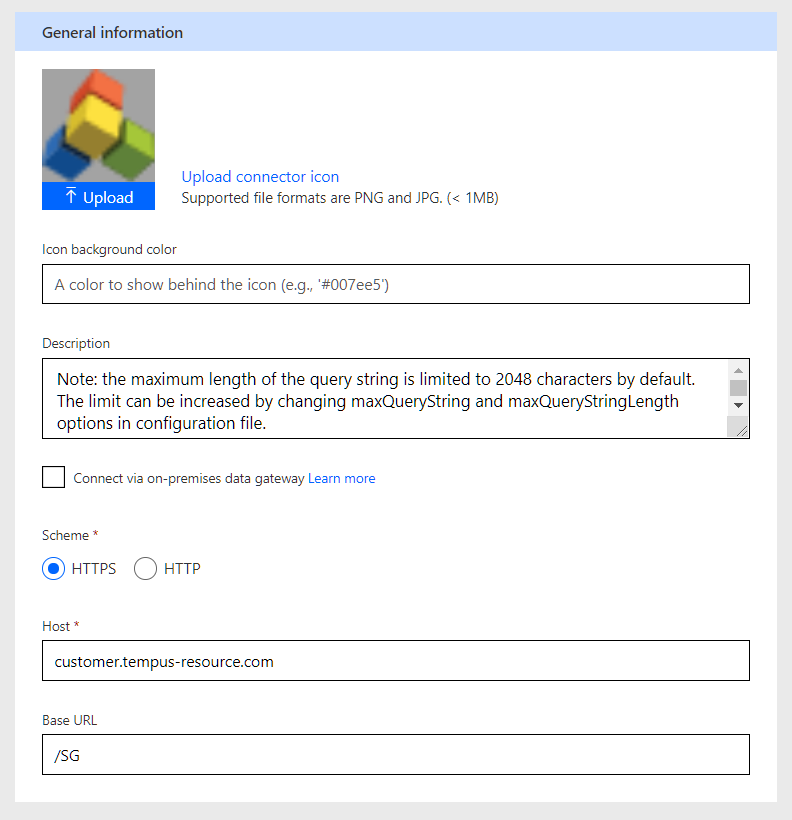
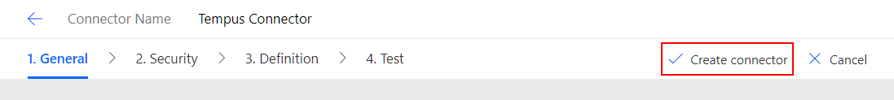

# Get started with Tempus in Microsoft Flow

## Create a Tempus connector

1. Copy the url for the OpenApi spec document for your version of Tempus. The spec documents can be found here: [https://github.com/ProSymmetry/TempusFlowIntegration/tree/master/OpenApi](https://github.com/ProSymmetry/TempusFlowIntegration/tree/master/OpenApi). You will want to use a link directly to the spec document. This can be obtained by clicking the Raw button on the file page.

The raw url should look something like this: [https://raw.githubusercontent.com/ProSymmetry/TempusFlowIntegration/master/OpenApi/462/spec462.json](https://raw.githubusercontent.com/ProSymmetry/TempusFlowIntegration/master/OpenApi/462/spec462.json)

2. Navigate to [https://flow.microsoft.com](https://flow.microsoft.com) and login.
3. On the sidebar, expand Data and click Custom connectors.

4. On the top right of the window, click New custom connector and select Import an OpenAPI from url.

5. Give the connector a name and paste the url obtained in step 1. Click Import.

6. After it validates the document, the Continue button should be enabled. Click it.

7. You should be presented with a new screen where you can specify additional information about the connector. Here you can upload an icon, set the icon background color, edit the description, and a few other things. If you want to use the default Tempus Icon, it can be obtained here: [./Assets/TempusIcon.png](./Assets/TempusIcon.png). Configure host to be the same as what you use when accessing Tempus. The base Url is typically /SG.

8. You can review the security configuration, API definition and perform API endpoint tests from the tabs available near the top of the window. Once you have finished, click Create Connector. The connector will now be available for use within your flows.

## Create a connection

TODO